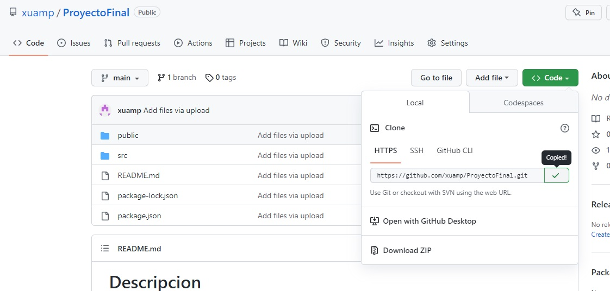

# Descripcion

Este es un proyecto de una tiena virtual o e-commerce de una papelera. En el mismo, aparecen una serie de productos de los cuales el usuario puede elegir cualquiera, y la cantidad que desee (siempre que haya stock),y estos se alojaran en un carrito de compra, para de manera posterior generar una orden de compra con los articulos seleccionados.

El carrito de compra se va llenando a medida que uno va seleccionando productos, y este carrito me muestra la cantidad de cada producto, la suma parcial del costo y la suma total del carrito con todos los productos sumados

Cuando se toca el detalle de cada producto, se redirecciona a una pagina donde aparecen los datos del mismo y la opcion de agregar la cantidad deseada por el usuario al carrito

Una vez seleccionado todos los productos y agregados al carrito, la pagina redirecciona al usuario a un formulario para que complete con sus datos y asi poder generar la orden de compra

Tanto la orden de compra como los datos de los productos estan contenidos en una base de datos, que brinda el servicio de Firebase

## Dependencias

Las dependencias usadas en este proyecto son:

### `1. create-react-app, y todas las dependencias que esta trae por defecto. Las cuales son:`

    @testing-library/jest-dom: 5.16.5

    @testing-library/react: 13.4.0

    @testing-library/user-event: 13.5.0

    react: 18.2.0

    react-dom: 18.2.0

    react-scripts: 5.0.1

    web-vitals: 2.1.4

### `2. firebase: 9.16.0`

Es un servicio gratuito de google que nos permite gener una base de datos, con distintas tablas. En este proyecto se utliza para almacenar en una base de datos toda la informacion de cada producto que luego se muestra en la app, y almacenar la base de datos con las ordenes de compra generadas por cada usuario

### ` 3. react-router-dom": 6.6.1`

Esta dependencia nos permite navegar entre los distinos componentes de nuestra aplicacion de manera dinamica. Se uso con el fin de poder interconectar nuestros componentes y navegar en la app de manera fluida entre sus partes

### ` 3. react-spinners: 0.13.8`

Esta dependencia nos permite importar distintos spinners o loaders para utilizar en nuestra app cuando hacemos alguna llamado que demora en su tiempo de respuesta, la cual en vez de que aparezca la pantalla vacia, nos muestra una pequeña animacion de que la pagina esta cargando

### ` 3. Fontawsome y Google Fonts`

En el archivo index.html, dentro de la etiqueta "head" se debe importar los siguientes links

    <link
      href="https://fonts.googleapis.com/css2?family=PT+Sans+Narrow&family=Roboto&display=swap"
      rel="stylesheet"
    />
    <link
      rel="stylesheet"
      href="https://cdnjs.cloudflare.com/ajax/libs/font-awesome/6.2.1/css/all.min.css"
      integrity="sha512-MV7K8+y+gLIBoVD59lQIYicR65iaqukzvf/nwasF0nqhPay5w/9lJmVM2hMDcnK1OnMGCdVK+iQrJ7lzPJQd1w=="
      crossorigin="anonymous"
      referrerpolicy="no-referrer"
    />

estos permiten importar las fuentes usadas a lo largo de la app, como asi tambien algunos iconos utilizados

## Pasos para ejecutar el codigo

1. Abrir en el escritorio GIT

 
2. ir al repositorio https://github.com/xuamp/ProyectoFinal, y copiar la URL del repositorio

3. en GIT usar el comando "git clone" y a continuacion pegar la URL del repositorio

4. Luego ir a la carpeta del proyecto, escribiendo el comando "cd ProyectoFinal"

5. Escribir el comando "npm i" para instarlar todas las dependencias del proyecto y poder ejecutarlo de la manera correcta

6. Por ultimo ejecutar el comando "npm start" para inicializar el proyecto en el navegador

luego de unos minutos, se abrira en el navegador el proyecto

## Deploy

Link: https://proyecto-final-khaki.vercel.app/

## Contacto

Programador Front-end

Instagram: Damian.ocampo03